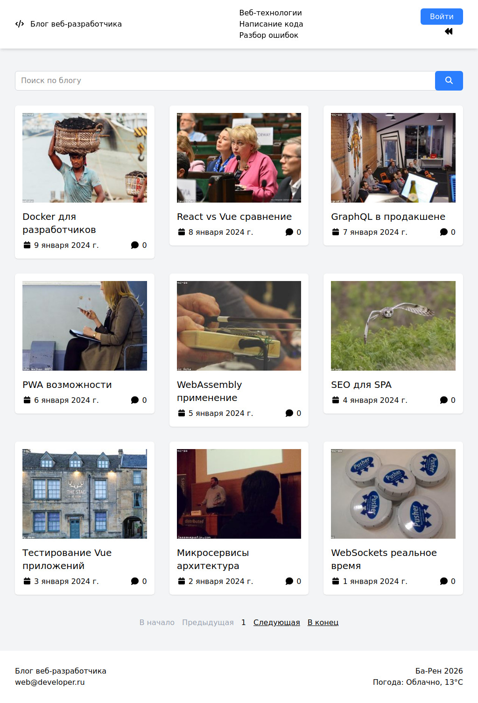

# Блог веб-разработчика

Блог с возможностью регистрации, добавления статей и комментариев.
Администраторы могут управлять пользователями и контентом. Сделано на Vue и
Express.

## О проекте

Обычный блог, где можно читать статьи, оставлять комментарии. Если есть права —
создавать и редактировать посты или управлять ролями других пользователей.

Еще добавил виджет погоды — показывает температуру по IP. Просто чтобы было не
скучно.

## Зачем я это сделал

Хотел собрать полноценное приложение с авторизацией, разграничением прав и
нормальной структурой. Интересно было попробовать связку Vue + Pinia на фронте и
Express + MongoDB на бэке. Ну и потренироваться с TypeScript — во фронтенде
старался писать всё с типами.

## Функционал

- Регистрация и вход (JWT в куках)
- Три роли: админ, модератор, обычный пользователь
- Просмотр статей (доступно всем)
- Комментарии к статьям (только для авторизованных)
- Создание/редактирование/удаление статей (только админ)
- Удаление комментариев (админ или модератор)
- Управление пользователями и их ролями (админ)
- Поиск по статьям + пагинация
- Погода по геолокации

## Архитектура / Особенности реализации

Бэкенд — обычный Express с монолитной структурой. Контроллеры, мидлвары для
проверки токена и ролей, хелперы для маппинга данных (чтобы не тащить лишние
поля из монги). Роуты разбиты логически: `auth`, `posts`, `users`.

Схемы MongoDB через mongoose. Для постов и комментариев сделал ссылочные связи —
комментарии хранятся отдельно, в пост кладутся их ObjectId. Потом при запросе
поста через `populate` подтягиваются сами комментарии с авторами.

На фронте — Vue 3, Pinia, TypeScript. Хранилища разделил по сущностям:
`article`, `articles`, `user`, `users`, `modal`, `roles`. Вынес типы, константы,
утилиты (debounce для поиска, формат даты).

Интересный момент — `mapPost` на бэке проверяет, является ли элемент
комментарием или ObjectId. Это потому что при создании поста без комментариев
там пустой массив, а при запросе одного поста через `populate` уже лежат
объекты.

## Стек

### Бэкенд

- Node.js / Express
- MongoDB + Mongoose
- JWT (jsonwebtoken)
- bcrypt
- cookie-parser
- dotenv

### Фронтенд

- Vue 3
- Pinia (стейт-менеджмент)
- TypeScript
- Vue Router
- Tailwind CSS
- Vite
- vee-validate + yup (валидация форм)
- FontAwesome

## Как запустить

### 1. Клонировать репозиторий

```bash
git clone https://github.com/B1ZON-c0de/Web-Developer-Blog.git
```

### 2. Бэкенд

```bash
cd backend
npm install
```

Создать файл `.env` в папке `backend`:

```
DB_CONNECTION_STRING=<ССЫЛКА ПОДКЛЮЧЕНИЯ К БД(Mongo DB)>
JWT_SECRET=<СЕКРЕТНЫЙ КЛЮЧ ДЛЯ JWT АУТЕНТИФИКАЦИИ>
```

Запустить:

```bash
npm run dev
```

Сервер будет на `http://localhost:3002`.

### 3. Фронтенд

В отдельном терминале:

```bash
cd frontend
npm install
```

Создать файл `.env` в папке `frontend` (API ключ для погоды можно получить в
Яндекс.Погоде):

```
VITE_YANDEX_WEATHER_API_KEY=<ВАШ АПИ КЛЮЧ ДЛЯ ЯНДЕКС ПОГОДЫ>
```

Запустить:

```bash
npm run dev
```

Фронтенд будет на `http://localhost:5174`.

### 4. База данных

Нужен запущенный MongoDB (локально или через Atlas). Строку подключения
прописать в `.env` бэкенда.

## Что можно улучшить

- Обработку ошибок на клиенте (сейчас просто в консоль)
- Валидацию на бэке (кроме урл картинки ничего не проверяется)
- Загрузку изображений вместо ссылок
- Комментарии с ответами (сейчас только плоские)
- Добавить сохранение пользователя между загрузками страницы с помощью Pinia(плагин persisted-state)

*Если картинки постов не отображаются включите VPN

### Скриншоты

